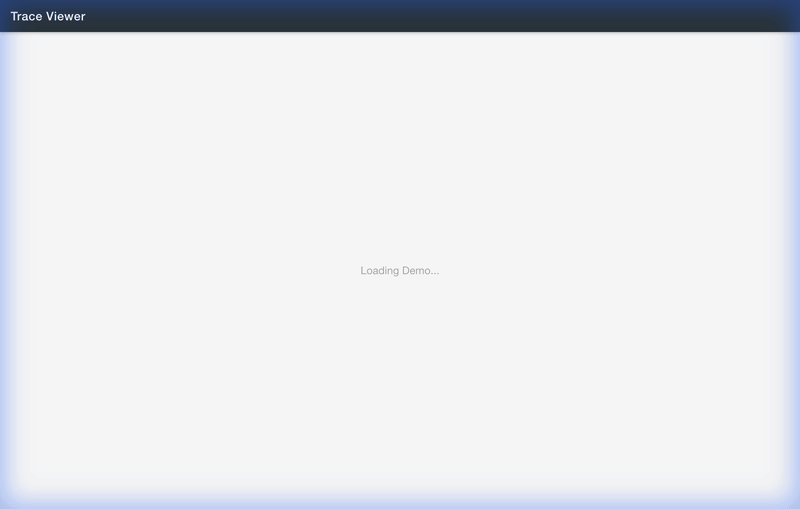

# Trace Viewer

A high-performance, Perfetto-like trace viewer built with React, TypeScript, and HTML5 Canvas.



## Features

- **High Performance**: Renders massive trace files using HTML5 Canvas.
- **Interactive Timeline**:
  - **Zoom**: WASD keys or Ctrl + Scroll.
  - **Pan**: Drag to pan or use Scroll.
  - **Selection**: Click events to view details.
- **Perfetto-like UI**: Dark mode, sharp text rendering, and intuitive navigation.
- **Robust Parsing**: Handles various JSON trace formats, including those with string timestamps.

## Getting Started

1.  **Install Dependencies**:
    ```bash
    npm install
    ```

2.  **Run Development Server**:
    ```bash
    npm run dev
    ```

3.  **Build for Production**:
    ```bash
    npm run build
    ```

## Usage

1.  Open the application in your browser.
2.  Drag and drop a standard JSON trace file (e.g., Chrome tracing format) onto the window.
3.  Use **W/S** to zoom and **Drag** to pan around the timeline.
